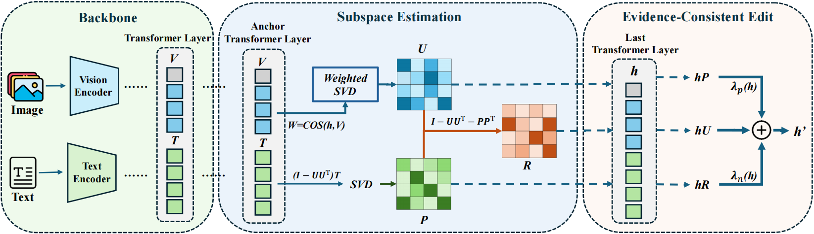

# HulluEdit: Single-Pass Evidence-Consistent Subspace Editing for Mitigating Hallucinations in Large Vision-Language Models

**CVPR 2026**

[Yangguang Lin](#), [Quan Fang](#), [Yufei Li](#), [Jiachen Sun](#), [Junyu Gao](#), [Jitao Sang](#)

This repository contains the official code of HulluEdit, a method for mitigating object hallucinations in LVLMs via Evidence-Consistent Subspace Editing.

## Overview

We introduce a novel method named **HulluEdit** (Evidence-Consistent Subspace Editing), which can effectively mitigate object hallucinations (OH) with **no extra inference cost** and **single-pass editing**.

HulluEdit edits model weights by extracting visual evidence subspaces and orthogonalizing the model behavior based on subspace projection:

- **Evidence Subspace Extraction**: HulluEdit first constructs a visual evidence subspace from image-conditioned token representations by analyzing the hidden states of truthful vs. hallucinated samples through Singular Value Decomposition (SVD), to find the main directions of visual grounding as the Evidence Space.
- **Anti-Prior Subspace Construction**: HulluEdit builds an anti-prior subspace to suppress language-only biases that lead to hallucinations, capturing the directions where models tend to generate objects not present in images.
- **Closed-Form Weight Editing**: Then HulluEdit applies a closed-form edit to the MLP weights in the LLM backbone of an LVLM, projecting to the evidence subspace while suppressing anti-prior directions. This procedure is applied across a series of layers in the LLM.

  

## Getting Started

### Environment Installation

Git clone our repository, creating a python environment and activate it via the following command:

```bash
git clone https://github.com/your-repo/HulluEdit.git
cd HulluEdit
conda env create -f environment.yml
conda activate hullu
```

Or manually:

```bash
conda create -n hullu python=3.10
conda activate hullu
pip install -r requirements.txt
```

### Model Setup

Prepare the following model checkpoints:

- **LLaVA-1.5 7B model**: Download weights from [liuhaotian/llava-v1.5-7b](https://huggingface.co/liuhaotian/llava-v1.5-7b).
- **MiniGPT-4 (LLaMA-2 Chat 7B)**: Download pretrained weights from [this link](https://github.com/Vision-CAIR/MiniGPT-4). Set the path in `configs/ecse_pope_minigpt4.yaml`.
- **MiniGPT-4 corresponding LLM**: Download weights from [meta-llama/Llama-2-7b-chat-hf](https://huggingface.co/meta-llama/Llama-2-7b-chat-hf).
- **mPLUG-Owl2 model**: Download from [MAGAer13/mplug-owl2-llama2-7b](https://huggingface.co/MAGAer13/mplug-owl2-llama2-7b).

Before running, you need to install a specific version of transformers:

- For LLaVA-1.5 and MiniGPT-4:

```bash
pip install transformers==4.37.2
```

- For mPLUG-Owl2:

```bash
pip install transformers==4.31.0
```

### Dataset

Model editing and evaluation require the MSCOCO 2014 dataset. Please download from [here](https://cocodataset.org/#download).

Organize the files as follows:

```
DATA/
├── annotations/
│   ├── instances_val2014.json
│   └── captions_val2014.json
└── val2014/
    ├── COCO_val2014_000000000042.jpg
    └── ...
```

Download the POPE dataset and place it under:

```
DATA/POPE/
├── coco_pope_random.json
├── coco_pope_popular.json
└── coco_pope_adversarial.json
```

## Evaluation

This section describes the three benchmarks used to evaluate object hallucination mitigation in HulluEdit: POPE, CHAIR, and MME. Each benchmark provides a different perspective on hallucination evaluation.

### POPE 

**POPE** is a polling-based evaluation benchmark designed to assess object hallucination in LVLMs by converting the hallucination problem into a binary classification task.

```bash
cd /root/Hullu
conda activate hullu
bash scripts/run_pope_llava.sh
```

### CHAIR

**CHAIR** is an automated metric that evaluates hallucination at the caption level by comparing generated descriptions against ground truth annotations.

```bash
cd /root/Hullu
conda activate hullu
bash scripts/chair_llava.sh
```

### MME

**MME** is a comprehensive benchmark that evaluates LVLMs across multiple perception and cognition tasks, including a dedicated hallucination assessment.

```bash
cd /root/Hullu
conda activate hullu
bash scripts/mme_llava.sh
```

## Citation

If you find this work useful or use our codes in your own research, please use the following bibtex:

```bibtex
@inproceedings{hulluedit2026,
  title={HulluEdit: Single-Pass Evidence-Consistent Subspace Editing for Mitigating Hallucinations in Large Vision-Language Models},
  author={Lin, Yangguang and Fang, Quan and Li, Yufei and Sun, Jiachen and Gao, Junyu and Sang, Jitao},
  booktitle={Proceedings of the IEEE Conference on Computer Vision and Pattern Recognition (CVPR)},
  year={2026}
}
```

## Acknowledgment

This repository builds upon the contributions of Deco and AlphaEdit. Thanks for their awesome works.
